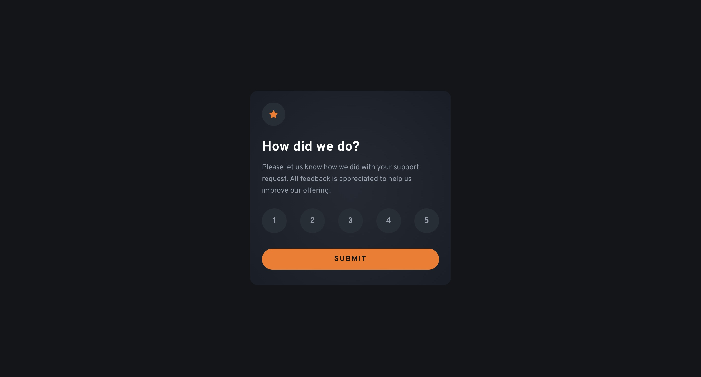

# Frontend Mentor - Interactive rating component solution

This is a solution to the [Interactive rating component challenge on Frontend Mentor](https://www.frontendmentor.io/challenges/interactive-rating-component-koxpeBUmI). Frontend Mentor challenges help you improve your coding skills by building realistic projects.

## Table of contents

-   [Overview](#overview)
    -   [The challenge](#the-challenge)
    -   [Screenshot](#screenshot)
    -   [Links](#links)
-   [My process](#my-process)
    -   [Built with](#built-with)
    -   [What I learned](#what-i-learned)
-   [Author](#author)

## Overview

### The challenge

Users should be able to:

-   View the optimal layout for the app depending on their device's screen size
-   See hover states for all interactive elements on the page
-   Select and submit a number rating
-   See the "Thank you" card state after submitting a rating

### Screenshot



### Links

-   Solution URL: [Solution URL](https://github.com/Joshk7/interactive-rating)
-   Live Site URL: [Live Site URL](https://interactive-rating-three-rho.vercel.app)

## My process

### Built with

-   Semantic HTML5 markup
-   CSS custom properties
-   Flexbox
-   CSS Grid
-   Mobile-first workflow

### What I learned

I started by laying out the base html having the initial state be a section with a header, paragraph, and form with radio button inputs and labels for ratings. I started with mobile and then moved on to desktop styles.

```html
<input class="radio" id="one" name="rating" type="radio" value="1" />
<label for="one">1</label>
```

```css
.radio:hover + label,
.radio:focus + label {
    background: var(--pure-white);
    color: var(--dark-blue);
}

.radio:checked + label {
    background: var(--orange);
    color: var(--dark-blue);
    font-weight: bold;
}
```

This initial setup made the JavaScript much simpler because the basic logic for radio buttons is built in to the design.

## Author

-   Website - [Joshua Kahlbaugh](https://joshuakahlbaugh.pages.dev/)
-   Frontend Mentor - [@Joshk7](https://www.frontendmentor.io/profile/Joshk7)
